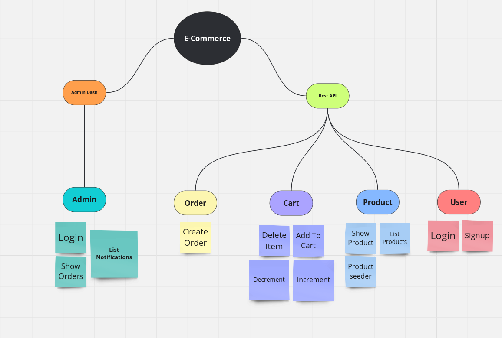
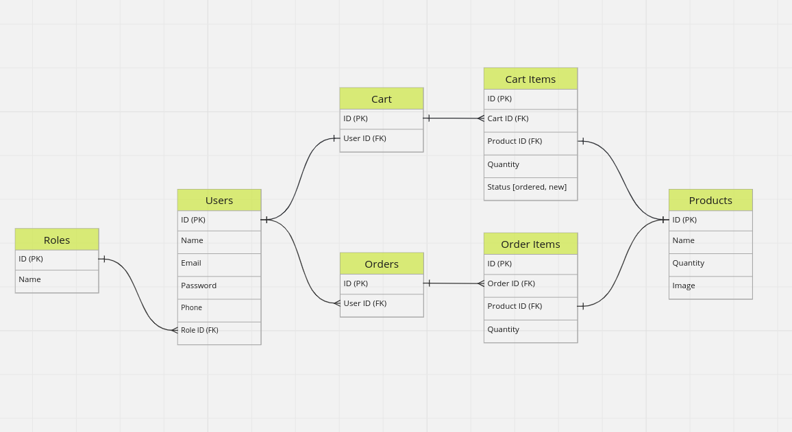

# E-Commerce Project using REST API

This project is a simple e-commerce application built using REST API architecture. It allows users to sign up, sign in, browse products, add items to their cart, manage cart items, create orders, and provides a simple dashboard for administrators to manage notifications and view orders.

## Technologies Used

- Laravel (PHP Framework)
- MySQL (Database)
- HTML, CSS, JS (Frontend Framework for Dashboard)
- Pusher (For Real-time Notifications)


## Project Structure

The project consists of the following main components:

1. **User Management**
   - Functionality: Sign up, Sign in

2. **Product Management**
   - Functionality: List products, View single product details
   - Seeder: Seed database with sample products

3. **Cart Management**
   - Functionality: Add to cart, Delete item from cart, Increment quantity, Decrement quantity

4. **Order Management**
   - Functionality: Create order
   - Notification: Send notification to admin when a new order is created using native Socket.io or Laravel Echo

5. **Admin Dashboard**
   - Functionality: Login to dashboard, List notifications, Show all orders


## Planing





## Installation and Setup

1. Clone the repository: 
    ```
    git clone https://github.com/Muhammed-saber79/E-Commerce-Task
    ```
2. Navigate to project directory:
    ```
    cd project-directory
    ```
3. Install dependencies: 
    ```
    composer install
    ```
4. Set up database and configure `.env` file
5. Run database migrations: 
    ```
    php artisan migrate
    ```
6. Seed database with sample data: 
    ```
    php artisan db:seed
    ```

## API Documentation

Detailed API documentation (Postman Collection) for various endpoints can be found [here](E-Commerce.postman_collection.json).

## Usage

1. Start the Laravel server: `php artisan serve`
2. Access the application in your browser: `http://localhost:8000`


## License

This project is licensed under the [Muhammed saber's License](https://www.github.com/Muhammed-saber79).